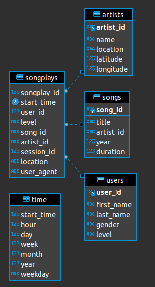

## Case of use:

Sparkify __wants to analyze the data they have been collecting about songs and user activity in their new music streaming app__.


To achieve the objective, the construction of a database `sparkifydb` with a star schema is proposed, which is described in the following image:
<div style="text-align:center"> </div>


## Run ETL

The ETL takes as input the content of the folders:
* `data/song_data/`: Each file is in JSON format and contains metadata about a song and the artist of that song. The files are partitioned by the first three letters of each song's track ID.
* `data/log_data/`: The files containst datasets consists of log files in JSON format, based on the songs in the dataset above.   
 

To run the ETL process in the terminal run the following commands:

```bash
python3 create_tables.py
python3 etl.py 
```